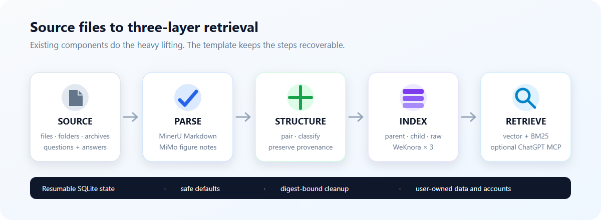

# MinerU → WeKnora question bank template

[中文](README.md) | [English](README.en.md)

[](https://github.com/xydadada/question-bank-template/releases/latest)
[](https://github.com/xydadada/question-bank-template/actions/workflows/audit.yml)
[](LICENSE)
[](https://github.com/new?template_owner=xydadada&template_name=question-bank-template)

I started this project after the work around each upload kept growing: sorting mixed files,
waiting for cloud parsing, restoring information from figures, pairing separate questions
and solutions, keeping enough state to resume, and checking that each index could retrieve
its own data.

This template connects those steps. MinerU parses documents, MiMo describes important
figures, and WeKnora stores parent records, child records, and full Markdown. The official
WeKnora MCP can expose those three retrieval layers to ChatGPT when needed. The project is
a self-hosted orchestration template built around existing components.

The maintained setup is Windows 11 with WSL2, Docker Desktop, and Ollama on Windows. The
repository contains code, blank configuration, and synthetic examples. Each user creates
and manages their own documents, keys, accounts, domains, knowledge-base IDs, and runtime
database.

> **Project status:** this is an alpha template under active development. Automated tests
> cover local state, safety interlocks, scripts, and failure recovery. Account validation for
> MinerU, MiMo, WeKnora, and ChatGPT happens in the user's environment. Start with a
> disposable file and keep every permanent-deletion setting at `false`.



## What it does

```text
files, folders, or archives placed in inbox
→ classify file types and route video to the ignored category
→ parse documents with MinerU
→ use MiMo to decide which figures matter and describe them
→ pair questions with answers at the document-group level
→ create parent, child, and raw Markdown layers
→ classify documents by type, institution, and physics module
→ upload the three layers to separate WeKnora knowledge bases
→ retrieve with vectors and BM25
→ optional: OAuth + Cloudflare Tunnel + official WeKnora MCP + ChatGPT
```

MiMo handles figure descriptions and classifications that remain ambiguous after the
deterministic rules. The local machine runs the Embedding model. Wiki generation, knowledge
graphs, summaries, and Rerank can be enabled after core retrieval is stable. Permanent
deletion starts with a `false` setting.

## When this template fits

- Your source collection mixes PDFs, Office files, images, folders, and archives.
- Questions and answers may live in separate files and should be paired before indexing.
- You want full source text as well as smaller question-answer records and parent context.
- You want ChatGPT to retrieve from a local question bank while reusing existing OCR, RAG,
  and MCP components.

MinerU owns parsing, WeKnora owns the knowledge bases and retrieval, Ollama runs local
models, and OAuth handles authorization. Wiki and Neo4j continue to use WeKnora's existing
features. `ingest.py` moves data between those components, records resumable state, and
handles failure recovery.

The maintained scope is a self-hosted question-bank pipeline for Windows 11 and WSL2. Users
supply the corpus and any model training. macOS and native Linux require adapted installation
entry points. For a handful of ordinary PDFs, direct WeKnora import is usually simpler.

## See the output first

The [minimal structure example](examples/minimal-physics/README.md) shows how a separate
question and solution become parent, child, and raw records. The oscillator problem was
written for this repository. The complete structure is visible locally and all content comes
from the synthetic sample in the repository.

## Safe defaults

The default configuration keeps files until the user explicitly authorizes deletion:

- Git ignores `.env`, `config.local.yaml`, documents, generated Markdown, logs, and
  `state.db`.
- Every script starts manually, while Windows Task Scheduler stays unchanged.
- WeKnora ports 8080 and 8088 bind to `127.0.0.1` only.
- Redis and Neo4j use `unless-stopped`, so a manual stop survives a Windows or Docker
  restart.
- Archive inspection checks paths, links, member count, and expanded size. Nested archives
  share one safety budget.
- Video, source archives, documents classified as `other`, and successfully indexed source
  files are retained by default.
- MCP uses a separate least-privilege profile. The OAuth proxy listens on
  `127.0.0.1:18081`.

Any permanent deletion also requires this local acknowledgement in `.env`:

```dotenv
QUESTION_BANK_ALLOW_PERMANENT_DELETE=I_UNDERSTAND
```

Explorer-style deletion propagation has a separate acknowledgement:

```dotenv
QUESTION_BANK_ALLOW_MANUAL_DELETION_SYNC=I_UNDERSTAND
```

Each action has its own acknowledgement. Start with a disposable document free of private
data and leave every deletion option set to `false`. Follow the
[smoke test](docs/SMOKE_TEST.md) before using real material.

## Requirements

- Windows 11 with WSL2 Ubuntu
- Docker Desktop, preferably with WSL integration enabled for Ubuntu
- Git for Windows
- Python 3.11 or newer, with the project environment managed by `uv`
- [uv](https://docs.astral.sh/uv/)
- Go 1.26 or newer, used only to build the official WeKnora CLI
- [Ollama](https://ollama.com/download)
- the `7z` command from 7-Zip, needed only for archive input
- your own MinerU API key when using the hosted parser; local MinerU needs no key
- your own MiMo API key only when MiMo is selected for vision or classification

The documented setup uses Docker Desktop, WSL2 Ubuntu, and Ollama on Windows. Native Docker
inside WSL can work when container access to Ollama is configured separately. Set a reachable
route for `host.docker.internal:11434` in that setup.

## Shortest installation path

`scripts/doctor.ps1` checks whether an existing clone is ready for retrieval or ingestion.
For a first installation, start with the bootstrap script:

```powershell
git clone https://github.com/xydadada/question-bank-template.git
cd question-bank-template
powershell -ExecutionPolicy Bypass -File .\scripts\bootstrap.ps1 -StartWeKnora
```

The bootstrap script creates ignored directories, the Python environment,
`.runtime/WeKnora`, and `bin/weknora.exe` inside the repository. If a missing system
component needs administrator access, the script stops and prints the official installation
link and leaves the system installation to the user. WeKnora is pinned to a reviewed release
commit.

After bootstrap:

1. Open <http://127.0.0.1:8088> and create or sign in to a local WeKnora account.
2. Select a local, hybrid, or cloud preset with `model_manager.py select`, then install it.
3. Run `powershell -File .\scripts\configure-weknora.ps1` and sign in through the official
   CLI. The script binds the selected embedding and optional chat model.
4. Copy `.env.example` to `.env` and add only the keys required by selected cloud roles.
5. Put a few disposable files in `inbox`, then start processing.

Parsing, OCR, vision, classification, embedding, and text generation are selectable roles.
See [local and cloud models](docs/LOCAL_MODELS.md) for presets and on-demand downloads:

```powershell
uv run python model_manager.py list
uv run python model_manager.py select local-light
uv run python model_manager.py install
```

```powershell
powershell -File .\scripts\start.ps1 -Processing
```

Check status or stop the stack:

```powershell
powershell -File .\scripts\status.ps1
powershell -File .\scripts\stop.ps1
powershell -File .\scripts\stop.ps1 -StopWeKnora
```

Run a direct three-layer search:

```powershell
uv run python ingest.py --search "your search terms"
```

Local OCR is optional. Install the extra dependencies only when you intend to enable it,
then set `ollama.ocr_enabled` to `true` in `config.local.yaml`.

```powershell
uv sync --extra ocr
uv run python -c "import rapidocr, onnxruntime; print('OCR extra ready')"
```

## Local directories

| Directory | Contents | Git status |
|---|---|---|
| `inbox/` | source files waiting for processing | ignored |
| `archives/` | extracted source archives, retained by default | ignored |
| `work/` | downloads, split files, screenshots, and temporary data | ignored |
| `markdown/` | final classified Markdown | ignored |
| `failed/` | failed source files that must be retained | ignored |
| `outputs/` | local reports and manual-deletion manifests | ignored |
| `.runtime/` | WeKnora source, logs, and PID files | ignored |
| `profiles/` | publishable classification templates | tracked |

The default configuration retains source files. After deletion is enabled, it applies only
to documents whose three index layers passed upload and retrieval checks. Failed files stay
on disk. See [configuration](docs/CONFIGURATION.md) for the switches and
[known limitations](docs/KNOWN_LIMITATIONS.md) for conditions that trigger a deliberate stop.

## Connect ChatGPT, optional

```powershell
powershell -File .\scripts\bootstrap.ps1 -InstallMcpTools
powershell -File .\mcp-public\configure-readonly-profile.ps1
powershell -File .\mcp-public\set-password.ps1
powershell -File .\mcp-public\setup-cloudflare.ps1 `
  -Hostname mcp.your-domain.example -CreateDnsRoute
powershell -File .\mcp-public\start-all.ps1 `
  -ExternalUrl https://mcp.your-domain.example
```

Add `https://mcp.your-domain.example/mcp` to the ChatGPT Workspace that will use it and
select OAuth authentication. The official WeKnora MCP exposes ten tools. `chat` and
`session_ask` create conversation records, so a Workspace administrator should disable
them for strict retrieval-only use. The remaining eight tools read or retrieve content.
See the [ChatGPT MCP guide](docs/CHATGPT_MCP.md) for setup and verification.

## Classification profile

`profiles/physics-question-bank.yaml` is a physics example. Its institution aliases are
blank on purpose. Fill them with names from your own collection. To use another subject,
copy the profile, edit its document types and module vocabulary, and set
`document_classification.taxonomy_file` in `config.local.yaml`.

## Components and project boundary

The template uses the official versions of these existing projects:

- [MinerU](https://github.com/opendatalab/MinerU) parses documents.
- [WeKnora](https://github.com/Tencent/WeKnora) stores the knowledge bases, builds indexes,
  and provides the official MCP.
- [Ollama](https://ollama.com/) runs the local Embedding model and optional OCR model.
- MiMo describes important figures and classifies documents that remain ambiguous after the rules.

This public repository is a reusable template. Each user creates three knowledge bases and
CLI profiles through the official tools, then keeps the question bank, knowledge-base IDs,
Cloudflare Tunnel, accounts, domains, logs, and runtime database in their own environment.
Git tracks the code, blank configuration, synthetic examples, and public classification
profiles. Third-party sources and pinned versions are listed in
[third-party notices](THIRD_PARTY_NOTICES.md).

## Contributing and license

Run these checks before submitting a change:

```powershell
powershell -File .\scripts\release-audit.ps1
uv run python -m unittest discover -s tests -v
```

GitHub Actions repeats them for pull requests and pushes to `main`. See
[CONTRIBUTING.md](CONTRIBUTING.md) for the repository rules. The project uses the
[MIT License](LICENSE); third-party components retain their own licenses.
